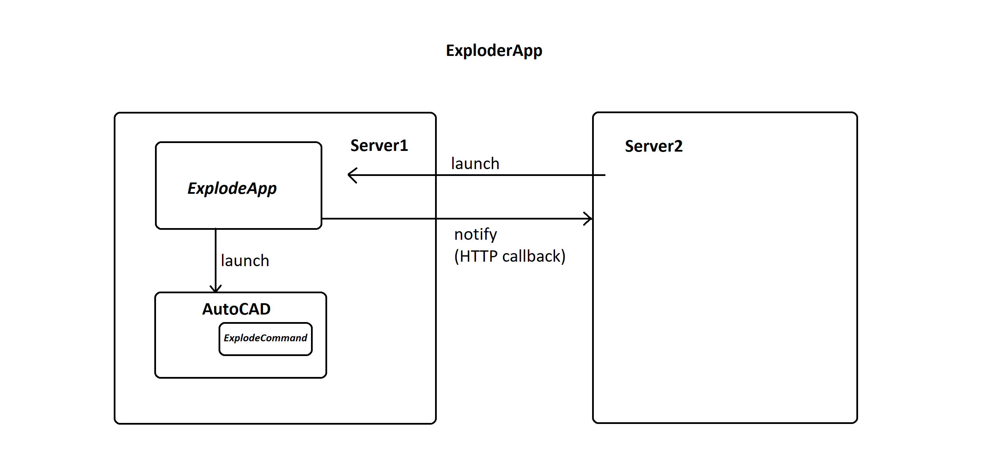
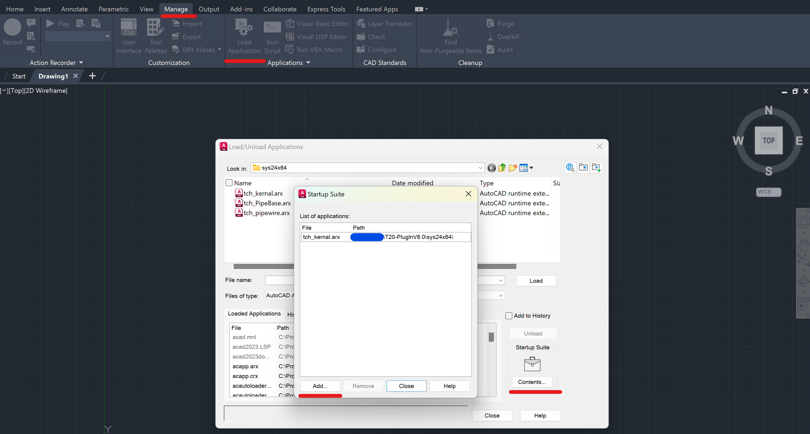

ExploderApp
===

- [ExploderApp](#exploderapp)
- [0. 基本原理](#0-基本原理)
- [1. 运行使用](#1-运行使用)
  - [环境要求](#环境要求)
  - [环境结构](#环境结构)
  - [使用方法](#使用方法)
  - [配置文件格式](#配置文件格式)
  - [注意事项](#注意事项)
- [2. 开发维护](#2-开发维护)
  - [1. `ExplodeCommand`](#1-explodecommand)
    - [依赖动态库](#依赖动态库)
    - [调试方式](#调试方式)
  - [2. `ExplodeApp`](#2-explodeapp)
    - [依赖动态库](#依赖动态库-1)
    - [调试方式](#调试方式-1)
    - [内部常量字段](#内部常量字段)
- [(3. 插件配置)](#3-插件配置)
- [其它相关参考资料](#其它相关参考资料)

# 0. 基本原理



# 1. 运行使用

## 环境要求

1. Windows 10 version 1809 or above
2. [.NET Framework 4.8 or later](<https://dotnet.microsoft.com/en-us/download/dotnet-framework> "Download .NET Framework")
3. AutoCAD 2023及[相关运行要求](<https://knowledge.autodesk.com/support/autocad-lt/learn-explore/caas/sfdcarticles/sfdcarticles/System-requirements-for-AutoCAD-LT-2023.html> "System requirements for AutoCAD LT 2023")
4. 相关自定义实体插件 (若需要, 比如[天正插件](http://tangent.com.cn/download/gongju/970.html))
5. (可能需要) `administrator`权限

## 环境结构
```
📦[Workspace]
 ┣ 📂(.tmp)
 ┣ 📂Configuration
 ┃ ┗ 📜Types.txt
 ┣ 📂Logs
 ┃ ┣ 📜...
 ┃ ┗ 📜Reports-{yyyy_MM_dd_HH_mm_ss}.log
 ┣ 📜ExplodeApp.exe
 ┗ 📜ExplodeCommand.dll
```
- `📜ExplodeCommand.dll`: 在AutoCAD中载入的自定义命令插件, 用于炸开在`Configutation/Types.txt`中指定类型的实体
- `📜ExplodeApp.exe`: 执行自动炸开命令的主程序 (包括启动AutoCAD与发送HTTP回调)
- `📂Configutation/📜Types.txt`: 记录所需炸开的实体类型的配置文件
- `📂Logs/`: 日志文件存放目录, 记录处理情况 (成功/失败原因). 时间戳为「CAD预初始化后」开始处理文件的时间点

- (`📂.tmp`): 记录`ExplodeCommand.dll`执行过程中的错误信息 (内容会被整合至`Logs/`下的日志中)


## 使用方法

- `ExplodeApp.exe CallbackUrl [FilePath FID ...]`

其中:
- `FID`为每个处理文件对应的**唯一**字符串
- `FilePath`为对应处理文件的**绝对路径**
- `Callback`为HTTP回调地址, 回调内容为`fid={fid}&state={stateCode}`. (`stateCode`为`4`时代表成功, `5`代表失败)

`FID`与`FilePath`必须成对出现, 总数不限

正常调用后, (若无活动中的AutoCAD进程则会令其启动) 会自动控制AutoCAD程序, 执行调用`ExplodeCommand.dll`中的命令. 切勿影响其运行.


## 配置文件格式

1. 每行一个正则表达式, 任意匹配其中之一的类型则会被执行炸开
2. 匹配检测的实体类型对应字段为`RxClass.DxfName`


## 注意事项

1. 如果反复出现AutoCAD无法启用的情况, 尝试以管理员权限运行
2. 初次运行需手动信任该插件 (`ExplodeCommand.dll`)
3. 炸开操作后的文件会自动保存并关闭 (覆盖保存)
   1. 由于该程序用于云服务器上, 原则上处理完毕后不存储用户的原始文件, 如需备份尽量在用户本地完成
   2. 若CAD已启动且存在未保存的文件, 执行该命令前先保存并关闭在当前CAD工作区的文件
4. 只能单进程执行, 无法并行
   - 但考虑到AutoCAD及炸开程序环境准备的时间开销, 将文件队列输入`ExplodeApp.exe`的执行效率仍要高于反复调用
5. 执行 (AutoCAD初始化及每个文件的打开与保存) 有一定失败概率 (可能与COM机制有关), 调用方可考虑增设重试阈值


# 2. 开发维护
```
📦ExploderApp
 ┣ 📂build
 ┣ 📂ExplodeApp
 ┣ 📂ExplodeCommand
 ┣ 📂SDK
 ┃ ┗ 📂ObjectARX
 ┗ 📜ExploderApp.sln
```

- `📜ExploderApp.sln`: 整个解决方案的配置文件 (VS2022, 可降级至VS2019使用)
- `📂SDK/`: 第三方依赖 (目前仅有`ObjectARX`的`.NET`相关基础动态库, 获取于`ObjectARX 2023`官方开发包)
- `📂ExplodeApp`, `📂ExplodeCommand`: 两个工程的对应源码目录
- `📂build`: 生成的二进制文件目录


## 1. `ExplodeCommand`

### 依赖动态库
`📂SDK/ObjectARX/.NET API/`:
- AcCoreMgd.dll
- AcDbMgd.dll
- AcMgd.dll

具体详见: [Components of the AutoCAD .NET API](https://help.autodesk.com/view/OARX/2023/ENU/?guid=GUID-8657D153-0120-4881-A3C8-E00ED139E0D3)

### 调试方式

1. 配置调试程序路径


其中
- `external program`为AutoCAD主程序**绝对路径**
- `Command line arguments`可自由配置 (比如可通过`/nologo`关闭启动logo减少等待时间), 详见[官方文档](https://knowledge.autodesk.com/support/autocad/learn-explore/caas/CloudHelp/cloudhelp/2023/ENU/AutoCAD-Core/files/GUID-8E54B6EC-5B52-4F62-B7FC-0D4E1EDF093A-htm.html)

然后正常通过Visual Studio启动调试即可 (支持断点)

## 2. `ExplodeApp`

### 依赖动态库
`📂SDK/ObjectARX/Interop`:
- `Autodesk.AutoCAD.Interop.Common.dll`
- `Autodesk.AutoCAD.Interop.dll`

具体详见: [COM Interoperability (.NET)](https://help.autodesk.com/view/OARX/2023/ENU/?guid=GUID-BFFF308E-CC10-4C56-A81E-C15FB300EB70)

### 调试方式

直接启动调试, 用法见[上述说明](#使用方法)

### 内部常量字段

- `PROG_ID`: [AutoCAD版本号](https://help.autodesk.com/view/OARX/2023/ENU/?guid=GUID-A6C680F2-DE2E-418A-A182-E4884073338A> "Release Number")
- `SUSPEND_PERIOD`: 为降低COM接口占用概率而增设的缓冲时间, 单位为`ms`


# (3. 插件配置)

以天正8.0插件为例, 直接运行官方的可执行程序, 会将插件自动载入到对应支持版本的CAD中. (副作用是程序必须以管理员权限运行)

(截止至2022.9.15) `T20 V8.0`官方并未明确支持AutoCAD 2023 (但2021-2023的工具链均是互相通用兼容的), 故需要手动在AutoCAD中载入.
(先前通过执行包载入的也可卸载插件后手动将插件文件载入, 避免管理员权限的要求)



如图所示, 将`tch_*.arx`添加进入自动加载项即可.

# 其它相关参考资料
1. [AutoCAD Developer Center](https://www.Autodesk.com/DevelopAutocad)
2. [AutoCAD Support and learning](https://knowledge.autodesk.com/support/autocad)
3. [Managed .NET Developer's Guide (.NET)](https://help.autodesk.com/view/OARX/2023/ENU/?guid=GUID-C3F3C736-40CF-44A0-9210-55F6A939B6F2)
4. [ObjectARX: Managed .NET Reference Guide](https://help.autodesk.com/view/OARX/2023/ENU/?guid=OARX-ManagedRefGuide-What_s_New)
5. [How can I improve the speed of .NET Plug-in Development? - StackOverflow](https://stackoverflow.com/questions/46889665/how-can-i-improve-the-speed-of-net-plug-in-development)
6. [Load/Unload Applications Dialog Box](https://knowledge.autodesk.com/support/autocad/learn-explore/caas/CloudHelp/cloudhelp/2023/ENU/AutoCAD-Core/files/GUID-49BC17B0-D6CC-4FD2-980F-184ACC9708E8-htm.html)
